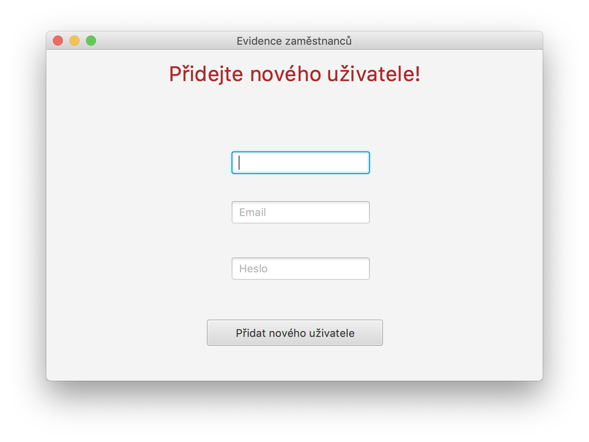

# Seminární práce - Evidence uživatelů

## Úvod
Toto téma jsem si vybral, protože mě baví práce s databazí. Mohl jsem si tak vyzkoušet práci s databází v Javě, zatím jsem měl zkušenosti pouze v práci PHP, ale v podstatě je to všude stejné, až na připojení atp.. Také jsem se naučil pracovat v JavaFX. Takže to pro mě byla výzva

## Struktura projektu

    ├── lib                           
    ├── out                             
    ├── src                            
    │   ├── pasek                       
    │   │   ├── Main.java             
    │   │   ├── FXML                   
    │   │   ├── entities               
    │   │   ├── images                  
    │   │   ├── infa                    
    │   │   ├── controllers             
    │   │   ├── utils                     
    │   │   └── user_table.sql 
    ├── .gitignore                 
    └── README.md
    
    
## Popis aplikace

#### Přihlášení

Toto okno můžeme najít v `FXML/login.fxml`. O fungování a reagování na tlačítka či inputy se stará `LoginController`. V tomto Controlleru probíhá ověřování hesla a e-mailu, pokud uživatel zadá špatné údaje, aplikace ho nepustí a do `error` lablu se vypíše error hláška.

#### Dashboard

Toto okno můžeme najít v `FXML/dashboard.fxml`. O fungování a reagování na tlačítka se stará `DashboardController`. Zde probíhá vypisování všech uživatelů v databázi do tabulky. Pokud nastane chyba, vypíše se do terminálu. Dále controller obsahuje tři metody pro obsluhování tlačítek - Přidat uživatele, Odstranit uživatele a Vypnout program.

#### Přidat uživatele

Toto okno najdeme v `FXML/addNewUserDiagram.fxml`. O fungování se zde stará `AddDialogController`. Pokud uživatel správně vyplní inputy v aplikaci a klikne na přidat uživatele. Pokud vyplnil všechny inputy a uživatel s emailem není v databázi, uživatel se úspěšně přidá a vracíme se zpět do dashboard okna. Pokud uživatel špatně vyplní inputy nebo zadá email, který je již v databázi, vracíme se zpět do dashboard okna a nic se nepřidá.

#### Odebrat uživatele

Toto okno najdeme v `FXML/deleteUser.fxml`. O fungování se zde stará `deleteUserController`. Otevře se zde okno, ve kterém najdeme jeden input (email) a tlačítko odebrat uživatele. Po zadání emailu program ověří, zda uživatel s tímto emailem v databázi skutečně existuje. Pokud ne, vracíme se zpět do dashboard okna bez žádné akce. Pokud program najde uživatele s tímto emailem v databázi, tak se uživatel smaže a vracíme se zpět do dashboard okna.

## Doplňující informace

#### Připojení na databázi
O připojení na databázi se nám stará třída `DatabaseConnect`, tu můžeme najít v package `utils`, kde najdeme připojení na databázi pomocí `JDBC`. 

#### Zpracování SQL dotazů
Zpracování SQL dotazů najdeme ve třídě `PersonImpl`. Mohlo by to být v každém controlleru, ale v rámci uklizení a jednoduchého čtení kódu jsem tyto funkce uklidit do samostatné třídy. Kde je to více přehledné.

#### Nastavování scén
Nastavování scén řeším třídou `newScene`, která obsahuje metodu `newScene`. Ta očekává dva parametry - Cestu k souboru a event.
    
## Zhodnocení projektu
Hodlám tento projekt víc aktualizovat, protože nynější verze je celkem nestabilní a má spoustu much. To je daň za to, že jsem se v krátkém čase musel naučit spoustu věcí. Všechny změny, které plánuji jsem si napsal dolů do sekce TODO list.

## TODO
- Redesign všech oken
- Přidání edit funkce, kdy uživatel může editovat uživatele
- Profile page
